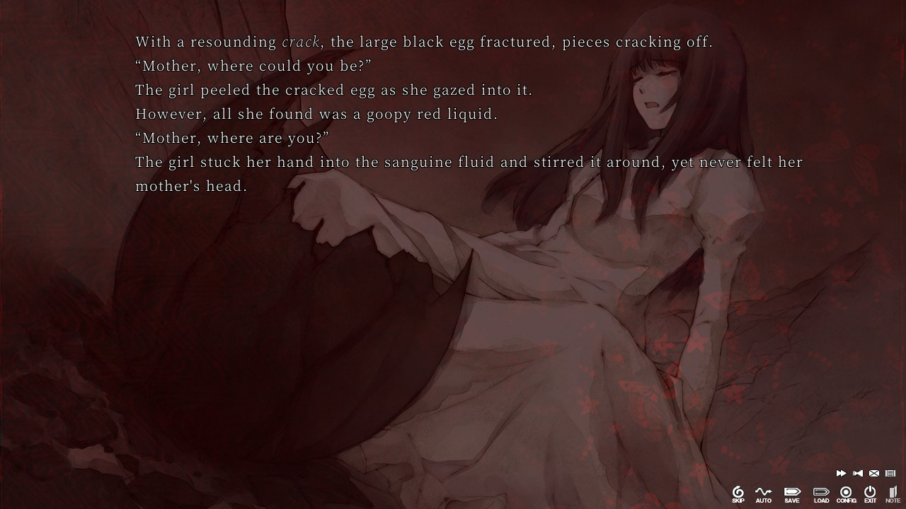
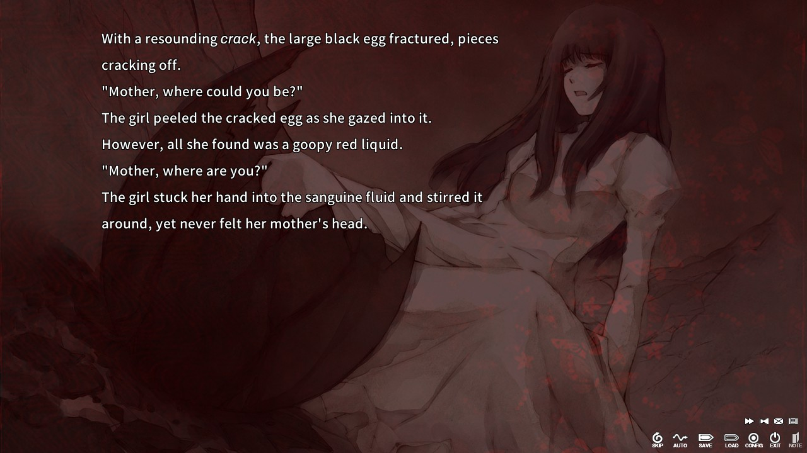
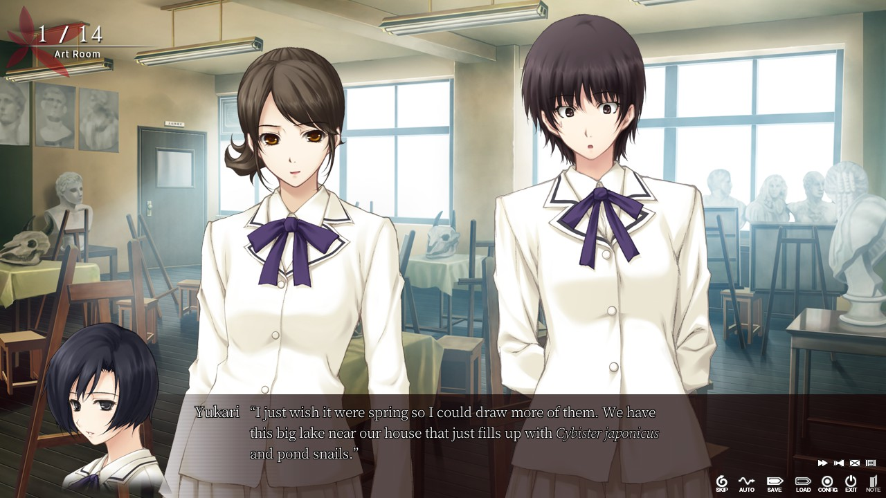
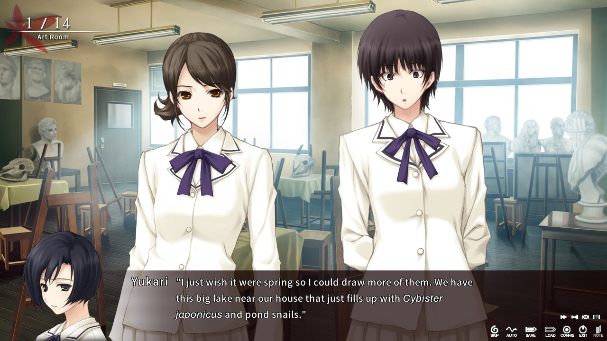
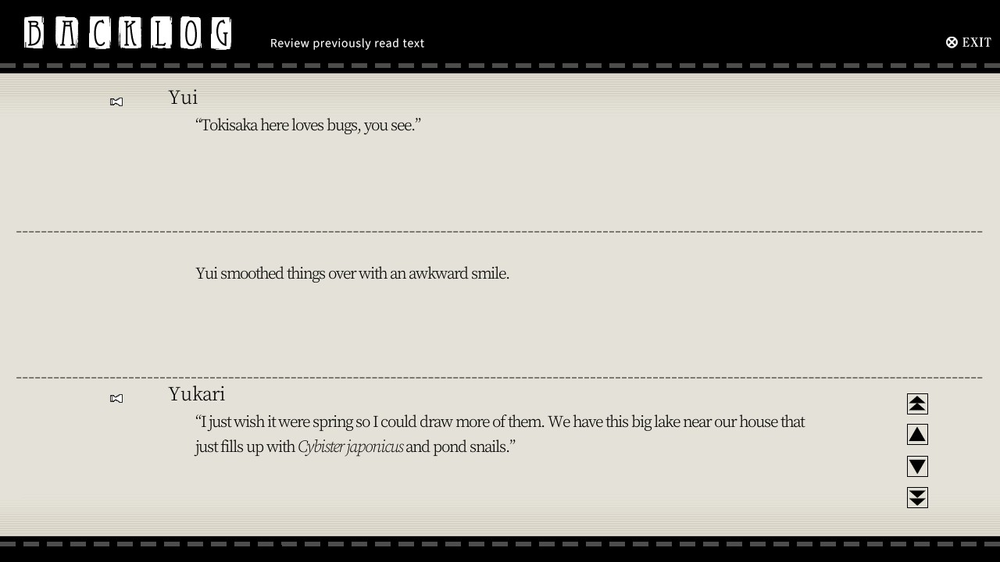
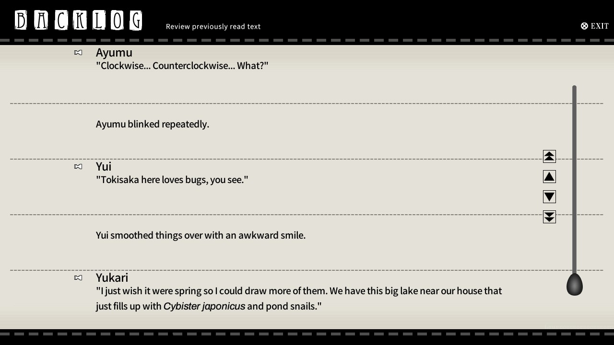

# The Shell Part 1: Inferno Improved Readability Mod
A mod that improves the readability of The Shell Part 1 by swapping out the fonts, increasing backlog functionality, and fixing other various things.

## <b><ins>Description</ins></b>
This mod applies to all languages, English, Traditional Chinese, and Simplified Chinese. Here's a list of what the mod does in detail:

- Swaps out the thin, serifed fonts with thicker, non-serifed fonts.
- Increases the size of the backlog from 3 blocks of text on screen to 5 blocks of text on screen.
- Adds a thematically appropriate scrollbar to the backlog to make looking through the backlog easier.
- Fixes a bug with the textbox and textbox icons that caused flashing when playing in fullscreen.
- Swaps out the dialogue's “” quotes for regular "" quotes, fixing spacing issues.
- Rebinds "Return to Title" to Esc instead of F12, since Steam screenshots are already on F12.

## <b><ins>Update 01: Mod Bug Fixes (2023/08/14)</ins></b>
- Moved text in textbox around to account for Natsume's massive head.
- Moved portraits down and to the left a little to better match the transparency fade to the edge of the screen.
- Swapped out the dialogue's ‘’ quotes for regular '' quotes, fixing spacing issues.
- Adjusted position of text-is-finished sparkle animation in both NVL and ADV scenes.
- Changed the "Natsuckme" translation to "Natsume darlin'" since that feels like a more appropriate translation of Natsume-chan in this scene.

## <b><ins>Update 02: Mod Bug Fixes (2023/08/25)</ins></b>
- Edited how choices text is displayed so that italics look correct.

## <b><ins>Update 03: Mod Bug Fixes (2025/01/29)</ins></b>
- The new update on Steam broke the mod and this fixes that issue.

### NVL Scenes
| Before  | After |
| ------------- | ------------- |
|   |   |

### ADV Scenes
| Before  | After |
| ------------- | ------------- |
|   |   |

### Backlog
| Before  | After |
| ------------- | ------------- |
|   |   |

## <b><ins>Installation</ins></b>

### Download
Download from the Releases page.

### Instructions
1. Unzip the patch and open the extracted folder.
2. Open the game's base directory from Steam by clicking the Gear Icon -> Manage -> Browse local files from the game's page in your library.
3. Drag and drop the TheShell.pfs.070 file into the game's base directory.
4. Launch the game and enjoy!

## <b><ins>Afterward</ins></b>
If you notice any issues, especially in either Chinese language, since I can't test them as thoroughly, please let me know and I will fix them. Also, there are still things in the game that I would like to fix/add. No promises, but I may update this mod in the future with more fixes and features.

### Special Thanks
Laureeeeeeeeeeeeeeen for all the image editing and for putting up with me asking for her to redo the egg slider icon again and again.
