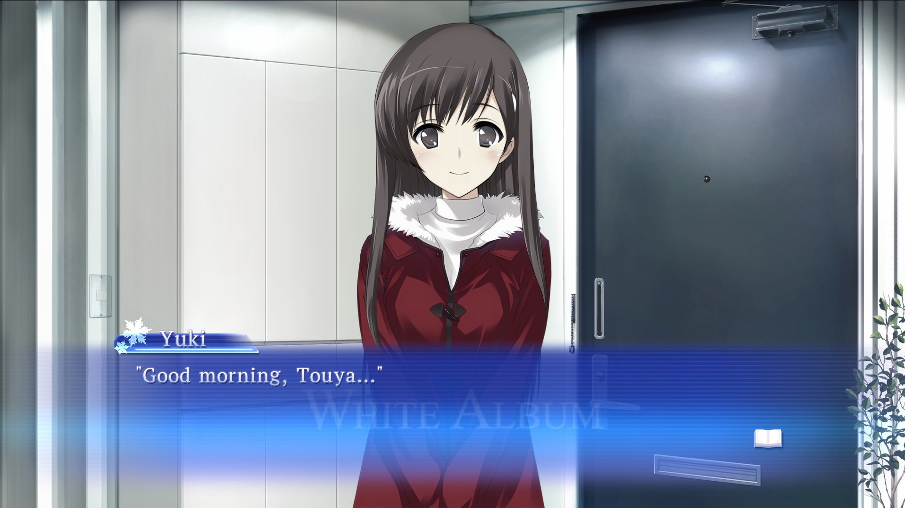
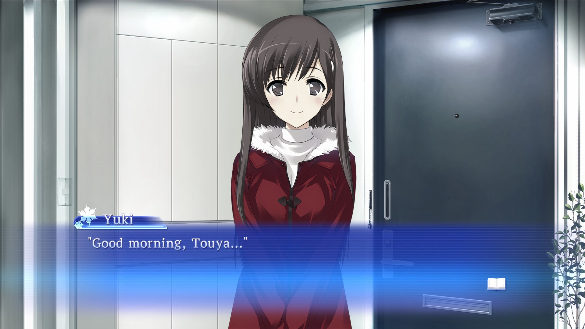
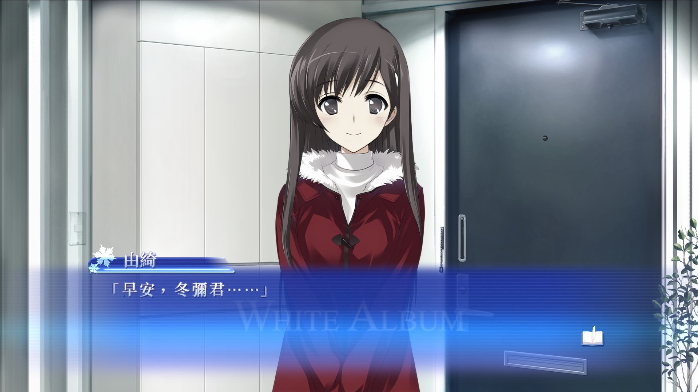

# White Album Clean Textbox Mod
A mod that overwrites the textbox image with a clean titleless textbox. Choose the one for your language.

## <b><ins>Examples</ins></b>

### English
| Before  | After |
| ------------- | ------------- |
|   |   |

### Japanese
| Before  | After |
| ------------- | ------------- |
|   |   |

### Traditional Chinese
| Before  | After |
| ------------- | ------------- |
|   |   |

## <b><ins>Installation</ins></b>

### Download
Download from the Releases page.

### Instructions

1. Unzip the mod and open the extracted folder.
2. Open the game's base directory from Steam by clicking the Gear Icon -> Manage -> Browse local files from the game's page in your library.
3. Navigate from the game's base directory to the game's language folder
    - English: /Data/Game/ENG
    - Japanese: /Data/Game/JPN
    - Traditional Chinese: /Data/Game/CHN
4. Copy the corresponding GameParts.tex file and paste it into the game's language directory, overwriting the existing file.
5. Launch the game and enjoy!
